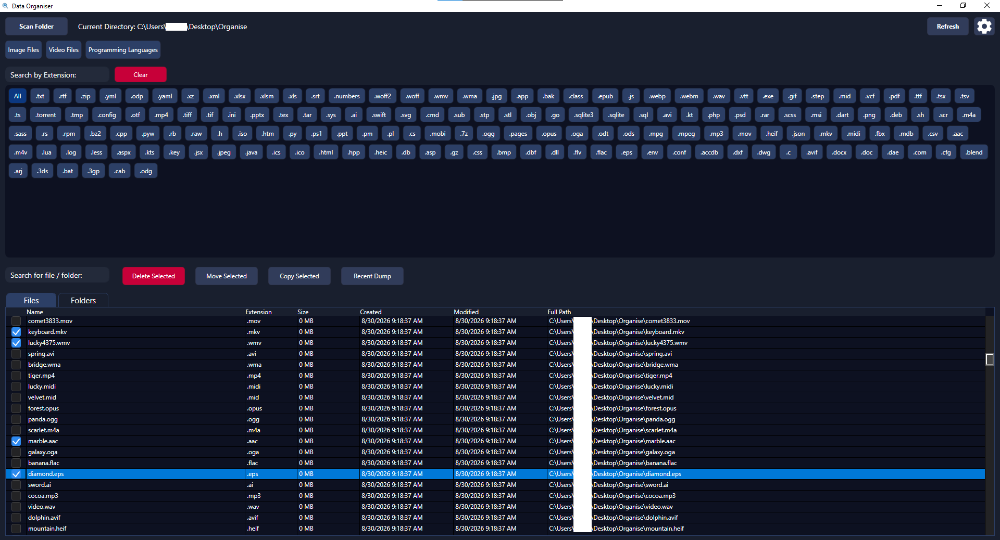
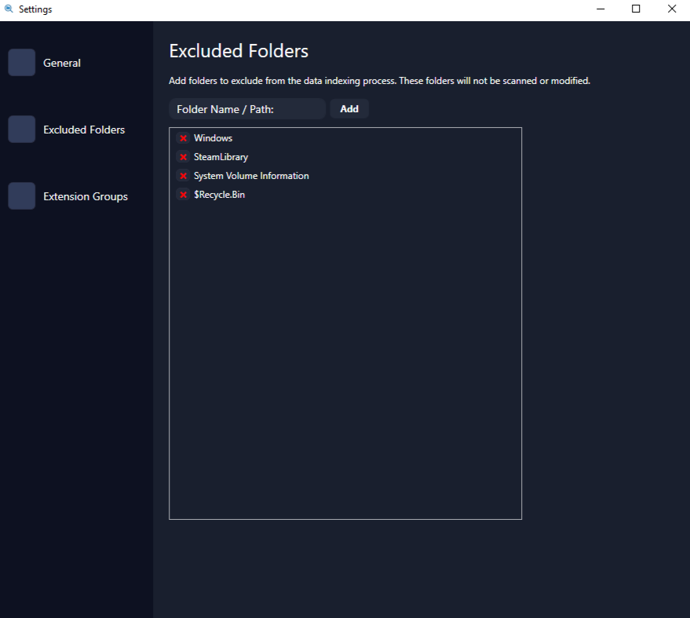
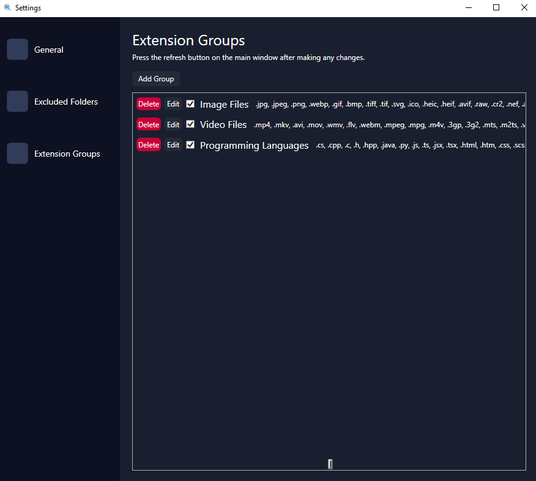

# DataOrganiser 

A file finder and data organiser tool in one, built to be powerful even with limited information.

Scan a folder or an entire drive, then narrow down what you're looking for by extension, partial name, and date in any combination.

Examples:
- You know it's a PDF, roughly from last month, and the partial name has "invoice" somewhere in it.
- You are looking to compile all of your music files, using the Audio Files extension filter or a custom Music extension filter (configurable in settings) to list all of your music.
- You made a folder for a project a few weeks ago and can't remember where you put it.
- You just saved something and it went into the wrong folder - Recent Dump shows everything created in a recent time window (configurable in settings).

It also has basic file management built in with features to move, copy, delete, open, or open to the file's location in Explorer.

## Dependencies

- Windows 10/11
- [.NET 9 Desktop Runtime](https://dotnet.microsoft.com/download/dotnet/9.0)
- [CommunityToolkit.Mvvm](https://www.nuget.org/packages/CommunityToolkit.Mvvm) — MVVM infrastructure, restored automatically via NuGet on build

## Getting Started

1. Grab the latest release from the [Releases page](https://github.com/luma162/DataOrganiser/releases).
2. Run the `.exe`.
3. If the .NET 9 Desktop Runtime isn't already installed, Windows will prompt you to install it and take you to the correct Microsoft download page.

If you'd rather install the runtime yourself ahead of time:

```powershell
# Install the .NET 9 Desktop Runtime via winget
winget install Microsoft.DotNet.DesktopRuntime.9
```

## Screenshots

 <br>
 <br>


## License

Licensed under the [MIT License](LICENSE) — free to use, modify, and distribute, including commercially, with attribution.